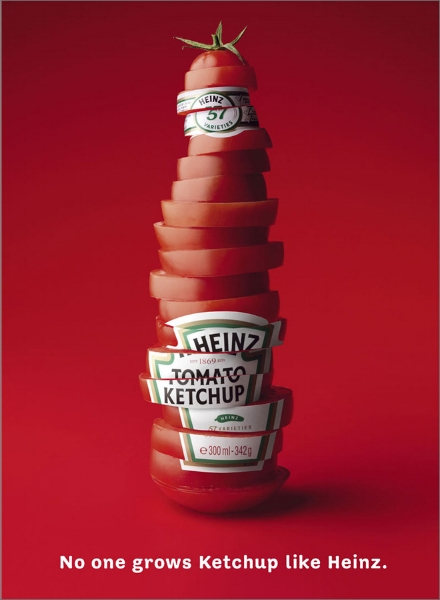
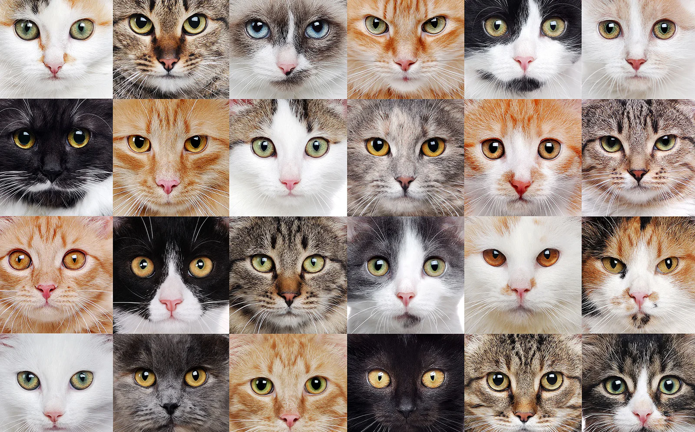

  <!-- About Me section -->
  <section class="project-item">
    
About Me

    
    

      I am researching how language and vision models interpret and generate metaphorical images by fine-tuning multimodal models and analyzing their outputs. My work involves dataset creation, model training, and evaluation to improve metaphor understanding in AI.
    

  </section>

  <!-- Projects header -->
  
Projects

  <!-- Projects grid -->
  

      
Classifying Visual Metaphors

      
      

        I built a classifier to detect visual metaphors in images using a custom dataset of 844   metaphorical and literal ads, leveraging CLIP and perplexity-based embeddings derived from image captions. Using scikit-learn, we trained logistic regression and SVM models. The best F1 score (0.682) came from logistic regression on CLIP embeddings; SVM with perplexity features improved by 1.5 points, highlighting their value for metaphor detection.
      

    

    
  <section class="project-grid">
    

      
Reddit Cat Breed Predictor

      
      

        I developed and deployed a Reddit bot that predicts cat breeds from user-submitted images using a fine-tuned OpenAI CLIP model. I automated image retrieval and commenting with Python, resulting in increased user engagement and high prediction accuracy.
      

    

  </section>

